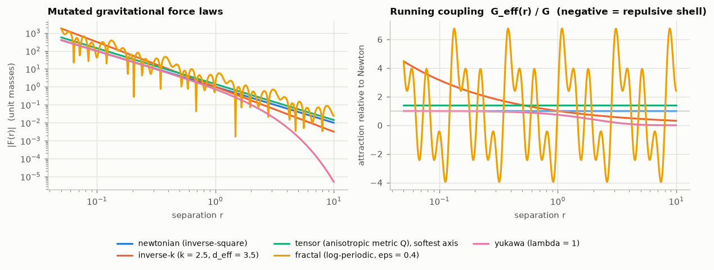
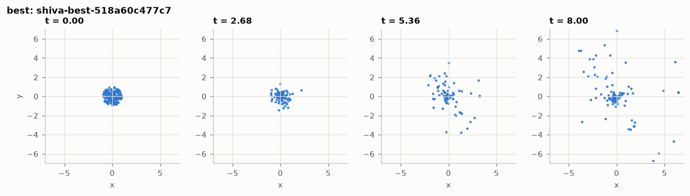
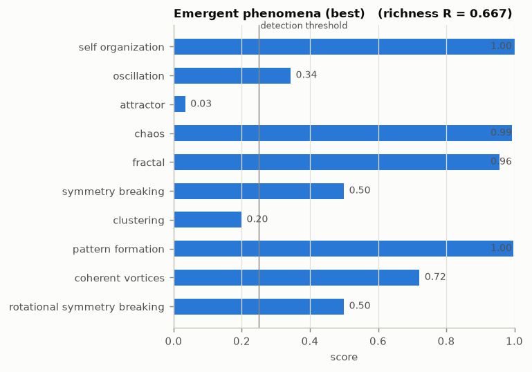
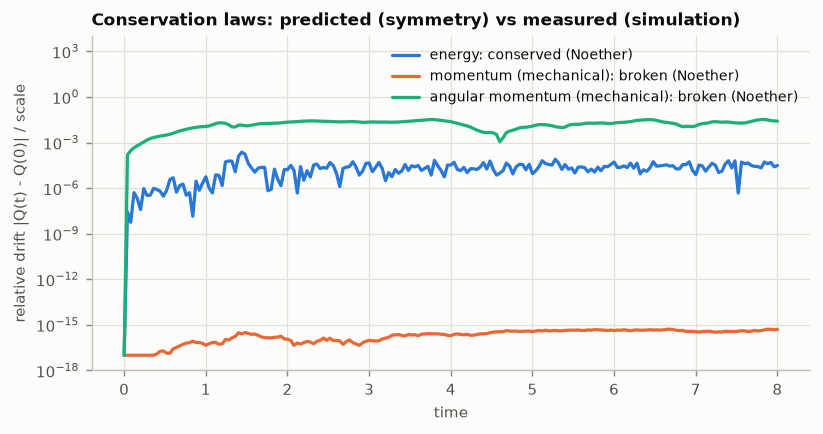
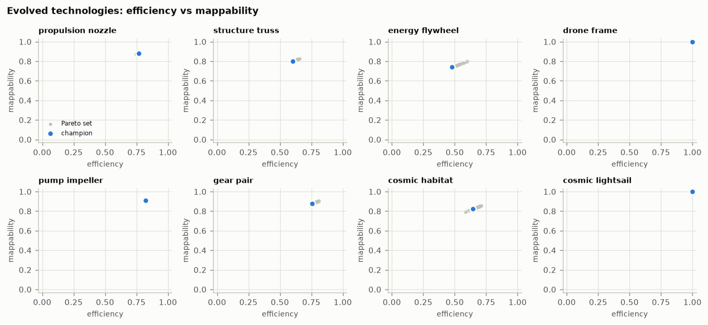
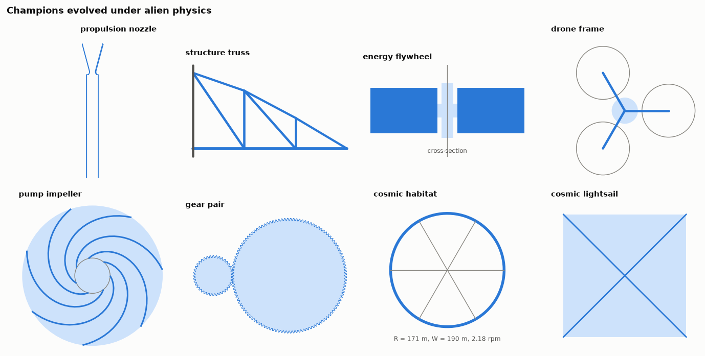
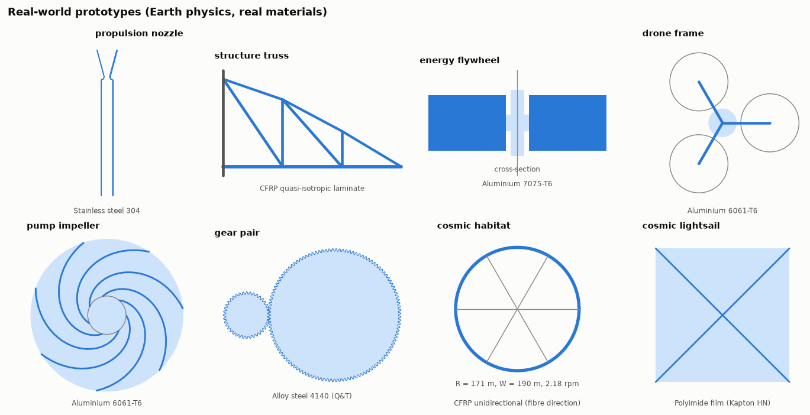

# SHIVA-1: Evolving Alternate Physics, Emergent Universes and Transferable Technologies

**SHIVA-1 project · whitepaper v0.2 (revised draft) · October 2026**

*Reproducibility:* every number in Sections 4–8 is produced by
`python -m shiva_core run --profile standard --seed 42` (machine-readable output in
[`results/summary.json`](results/summary.json), tables in [`results/results.md`](results/results.md)).
Theory and derivations are in the [cosmic appendix](cosmic_appendix.md).

---

## Abstract

We present SHIVA-1, an open, first-principles software system that closes the loop between
*alternate laws of physics*, the *universes* they generate, the *phenomena* that emerge in them, and the
*technologies* that can be evolved inside them and carried back to our own universe. Laws are encoded as
physics genomes — gravitational force laws along a nested ladder (inverse-square → inverse-k → tensor →
log-periodic "fractal"), electromagnetic couplings, inertia laws, thermodynamic baths, fluid operators,
interaction symmetries and a Newtonian cosmological constant — whose potentials are written in SymPy and
whose conservation laws are *derived* by an automated Noether analysis rather than imposed. A symplectic
splitting integrator simulates particles, rigid bodies and continuum fields; twelve emergence estimators
condense each universe into an emergent-richness score; evolutionary, novelty-driven and reinforcement-learning
search explores the space of laws; and eight engineering domains are evolved under the physics of the
winning universe, then projected onto real materials and manufacturing standards and exported as
parametric CAD. In a reproducible reference run (seed 42) the automated Noether analysis predicted the conservation
structure of all twelve symmetry-breaking test universes without exception (symmetry-protected momenta conserved
to $\le 8\times10^{-16}$, energies to $\le 4\times10^{-5}$), simulated two-body orbits precessed by exactly the
symbolically predicted apsidal angle, and two closed forms derived here — quantised stability bands in
log-periodic gravity and a preferred clustering scale for inverse-$k$ gravity with $2<k<4$ — were checked against
SymPy-numeric analysis and classical limits. A search over 59 universes,
protected by held-out validation that repeatedly exposed the winner's curse (a CMA-ES-refined candidate fell from
fitness 0.589 to a validated richness of 0.501), selected a tensor-gravity universe ($k = 2.5$, anisotropic metric,
short-range soft core, weak de Sitter $\Lambda$). On five unseen seeds its emergent richness was $0.624\pm0.026$
versus $0.558\pm0.083$ for Newtonian gravity — higher, but **not statistically significant** (Welch $p = 0.15$).
An estimator audit showed that an earlier, apparently significant advantage ($p = 0.02$) was partly an aliasing
artefact. Under the winner's physics all eight engineering domains produced feasible Pareto-optimal designs; all
eight were mapped onto real materials and standard stock (fidelity 0.87–1.00), with Monte-Carlo as-built
reliabilities, bills of materials, build instructions and OpenSCAD-verified CAD.

## 1. Introduction

Why are the laws of physics the way they are, and what would be *possible* if they were different? Two
traditions approach the first question: fine-tuning arguments that map habitable windows of constants
(Barrow & Tipler 1986; Tegmark 1998) and ensemble views that treat our laws as one point in a space of
mathematical structures (Tegmark 1998). A third tradition — artificial life and open-ended evolution — asks
which *rules* generate rich behaviour. Meanwhile generative engineering design has shown that search over
design spaces discovers non-intuitive artefacts (Stanley 2007; Bendsøe & Sigmund 2003).

SHIVA-1 joins these threads into one computational experiment:

1. **Generate** consistent alternate physics, where every conservation law is a consequence of a declared
   symmetry and every force is the exact gradient of a symbolic potential.
2. **Simulate** the resulting universes across particle, rigid-body and continuum scales with integrators whose
   invariants are known, so that measured conservation can *test* the predicted symmetry structure.
3. **Detect** emergent phenomena with standard, citable estimators and combine them into a richness score.
4. **Search** the space of laws for rich universes, guarding against the statistical traps of noisy
   fitness (winner's curse) with a train / validation / test protocol.
5. **Evolve** technologies under the winning universe's physics, and **map** them back to buildable designs in
   ours, with explicit materials, tolerances, reliability estimates, build instructions and CAD.

**Contributions.** (i) A physics-genome representation with a nested gravitational ladder and automatic
symbolic verification of field equations, orbits and Jeans stability; (ii) an executable Noether analysis whose
predictions are validated to machine precision across twelve symmetry-breaking universes; (iii) closed forms for
orbital stability in log-periodic gravity and for gravitational instability under inverse-k and anisotropic laws,
checked by tests against numerics and classical limits; (iv) an end-to-end, reproducible pipeline from laws to CAD, including a dimensional bridge
(Press–Lightman scaling) from an alien genome to engineering constants; (v) an honest empirical study, including
negative and non-significant results.

## 2. System architecture

```
 physics_mutator ──► universe_simulator ──► emergence_detector ──► ai_brain (universe search)
   genomes, SymPy      particles · rigid       12 estimators,          GA · CMA-ES · NSGA-II ·
   Noether analysis    bodies · fields         richness score          NEAT/CPPN · PPCA · RL
                                                                             │ validated winner
        cad_generator ◄── real_world_mapper ◄── tech_evolver ◄──────────────┘
        SCAD · STL ·      materials · SLSQP      8 domains under the
        FreeCAD macro     projection · MC · BOM  winner's physics
```

| module | role | key methods |
|---|---|---|
| `physics_mutator` | alternate laws | genome, 10 mutation operators, crossover, SymPy potentials/forces, field-equation verification, orbital and Jeans analysis, Noether analysis |
| `universe_simulator` | dynamics | Strang splitting K·R·D·O·D·R·K, Yoshida-4, RK4 control, BAOAB, Boris rotation, retarded forces, Lyapunov twins, rigid-body axis splitting, pseudo-spectral vorticity, Gray–Scott |
| `emergence_detector` | phenomena | entropy & LMC complexity, order parameters, periodograms, RQA, Lyapunov, Grassberger–Procaccia, CUSUM, FoF, Landy–Szalay |
| `ai_brain` | search & learning | GA, CMA-ES, NSGA-II, NEAT, CPPN, PPCA, REINFORCE, UCB1, `ShivaBrain` |
| `tech_evolver` | engineering under alien physics | `PhysicsContext`, 8 domains, NSGA-II, PPCA augmentation, adaptive-design RL, CPPN bracket |
| `real_world_mapper` | translation to our universe | materials DB, Ashby ranking, margin-constrained projection, catalogue snapping & repair, Monte-Carlo reliability, BOM, build steps |
| `cad_generator` | manufacturing output | watertight mesh kernel, parametric OpenSCAD, binary STL, FreeCAD macro |

The system is ~8.4 k lines of documented NumPy/SciPy/SymPy code plus an 89-test suite.

## 3. Methodology

### 3.1 Physics genomes and consistent mutation

A genome holds seven genes (gravity, electromagnetism, inertia, thermodynamics, fluid, interaction,
cosmology) plus the spatial dimension (3 by default; the dimension operator is disabled so dimensionality is never
reduced unless explicitly requested). The gravitational ladder is **nested** — each rung contains the previous as
a special case:

$$U = -G\,\phi_k(\rho)\Big[1+\epsilon\sum_{n=0}^{N-1}\gamma^n\cos\big(\omega\beta^n\ln\tfrac{\rho}{r_0}\big)\Big],\qquad
\phi_k(r)=\frac{r^{1-k}}{k-1},\quad \rho^2 = x^{T}Qx,\ \det Q = 1,$$

with inverse-square ($k=2$, $Q=I$, $\epsilon=0$), inverse-k ($Q=I$, $\epsilon=0$), tensor ($\epsilon=0$) and fractal
rungs, plus a Yukawa branch $-Ge^{-r/\lambda}/r$ and an optional $G(t) = G(1+a\sin\Omega t)$. Electromagnetism offers
Coulomb, power-law and Proca couplings with $k_e \propto \alpha/\alpha_0$ and a uniform $B$ field. Inertia offers
Newtonian, relativistic ($T=\sqrt{p^2c^2+m^2c^4}-mc^2$ with a mutable $c$), anisotropic-mass and power-law
kinetic energies — all separable, so symplectic integration remains available. Thermodynamics provides a
fluctuation–dissipation-consistent Langevin bath with Gaussian or Tsallis q-Gaussian noise and Rayleigh–Helmholtz
active friction; interactions provide finite-speed (retarded) propagation and multi-species coupling matrices
that may be **non-reciprocal**.

*Consistency principle.* Every conservative channel is a SymPy potential $U(r)$; the simulator never sees a
hand-written force but the compiled kernel $\kappa(s) = -2\,\mathrm{d}U/\mathrm{d}s$ ($s = |x_i-x_j|^2_Q + \epsilon^2$),
so forces are exact gradients by construction. Conservation laws are **derived, not mutated**:
`noether_analysis` inspects time-translation, translation, rotation (axes common to all active tensors and to $B$),
time-reversal and phase-space-volume symmetry and predicts which of energy, (pseudo-)momentum and (canonical)
angular momentum are conserved. The *symmetry* operator breaks or restores one symmetry at a time — the only
consistent way to "mutate a conservation law". Each genome's field equations (Gauss law in $d_{\rm eff}=k+1$,
screened Poisson, anisotropic Poisson, Proca) are verified symbolically or at random points, and the Tsallis
entropy functional is proven to reduce to Shannon's as $q\to1$.

### 3.2 Universe simulation

**Particles.** The flow is split as $K(\tfrac h2)R(\tfrac h2)D(\tfrac h2)O(h)D(\tfrac h2)R(\tfrac h2)K(\tfrac h2)$:
kicks by all position-dependent forces, exact rotation of momenta about $B$ (preserving $T(|p|)$), drifts with
the mutated velocity $v = \partial T/\partial p$, and an Ornstein–Uhlenbeck/dissipative sub-flow (BAOAB; exact
logistic update for active friction). Without $O$ and $R$ this is Störmer–Verlet; `yoshida4` composes it to fourth
order. All arrays carry a batch axis holding a shadow trajectory displaced by $10^{-7}$ and driven by the same
noise, giving the maximal Lyapunov exponent by Benettin renormalisation. Retarded forces read source positions
from a ring buffer at lag $|x_i-x_j|/c_{\rm prop}$.

**Rigid bodies** rotate by the exact axis-splitting $R_1R_2R_3R_2R_1$ of $H=\sum L_i^2/2I_i$; optional internal
dissipation at constant $|L|$ is applied with a compensating attitude rotation. **Fields**: a pseudo-spectral 2-D
vorticity solver with dissipation operator $\nu(k^TNk)^h+\alpha$ (integrating-factor RK4, 2/3 de-aliasing,
Kolmogorov forcing) and an anisotropic Gray–Scott reaction–diffusion model.

**Evaluation.** *Stability* (survival, no singular collapse below the softening length, resolved energy when
energy is predicted conserved); *Noether consistency* (fraction of predicted invariants whose measured relative
drift is below tolerance: $10^{-6}$ for mechanical momenta, $2\times10^{-2}$ for energy and magnetic canonical
quantities); *cosmic feasibility* $=$ survival $\times\sqrt{f_{\rm bound}}\times e^{-|Q_v-1|}$, combining the bound
fraction with the generalised (Clausius) virial ratio.

### 3.3 Emergence detection

| phenomenon | estimator | score in [0, 1] |
|---|---|---|
| self-organisation | drop of coarse-grained spatial entropy; LMC complexity; polarisation/milling gain | max of normalised gains |
| oscillation | detrended periodogram peak / running-median background, resolved periods only (≥ 2 cycles, ≥ 4 samples per cycle) | $(\log_{10}r - 0.5)/1.5$ |
| attractor | RQA determinism at 10 % recurrence × stationarity | product |
| chaos | Benettin λ (Rosenstein fallback) | $1-e^{-\lambda t_{\rm dyn}}$ |
| fractal | Grassberger–Procaccia $D_2$ vs same-size Poisson reference | fit $R^2$ × dimension deficit |
| symmetry breaking | CUSUM change points of asphericity, polarisation, milling, spin | magnitude × effect size (× ½ if not spontaneous) |
| cosmic clustering | FoF ($b=0.2\bar\ell$), Landy–Szalay ξ(r) | clustered fraction × multiplicity |
| pattern formation | Turing spots/stripes in Gray–Scott | contrast × component count |
| coherent vortices | vortex count, vorticity kurtosis | product |
| rotational symmetry breaking | intermediate-axis flips, major-axis capture | mean |

The emergent richness is $R = S\,(0.7\,\bar s_w + 0.3\,c)$ where $S$ is stability, $\bar s_w$ the weighted mean
score and $c$ the fraction of phenomena above the 0.25 detection threshold — rewarding universes that are stable
and show *many* phenomena at once.

### 3.4 Searching the space of laws

`ShivaBrain` evolves genomes with fitness $F = R\,(0.75 + 0.25\,\text{feasibility})\,\text{consistency}$ averaged
over two initial-condition seeds, selects by $(1-w)F + wN$ with novelty $N$ = mean distance to the 5 nearest
behaviour descriptors in an archive (Lehman & Stanley 2011), chooses mutation operators with a UCB1 bandit
(Auer et al. 2002), adapts mutation strength by the 1/5th success rule, and finally refines the winner's
continuous constants with CMA-ES (Hansen 2016). Because fitness is noisy and resolution-dependent, the pipeline
uses a **three-way protocol**: (1) *search* at low resolution ($N=64$, 1200 steps); (2) *validation* of the top
four distinct candidates at full resolution ($N=160$, 4000 steps, fields and rigid bodies) on three fresh seeds,
selecting the best mean; (3) a *test* comparison of the selected universe with the Newtonian baseline on five
further seeds that played no part in any selection (Welch's t-test).

### 3.5 Technology evolution under alien physics

`PhysicsContext.from_genome` converts a genome to engineering constants: gravity ratio from the SymPy force at
one length unit; moduli and strengths $\propto\alpha^5$ and densities $\propto\alpha^3$ (Press & Lightman 1983);
gas viscosity $\propto\alpha^2$; drag-law exponent, adiabatic index and speed of light from the genome. Eight
domains with first-principles reduced-order models are evolved by NSGA-II (Deb et al. 2002) on five objectives —
**efficiency**, **stability** (normalised safety margins), **adaptability** (mean × (1 − CV) of efficiency over
five ±15 % perturbed alien contexts), **real-world mappability** (feasibility and efficiency ratio on Earth) and
**cosmic performance** (mean over Earth, Mars, Titan, Venus cloud layer and the Moon, with alien materials).

| domain | model |
|---|---|
| propulsion nozzle | isentropic area–Mach, $C_F$, $c^*$, divergence loss, Summerfield separation, hot-wall hoop stress |
| structural truss | direct-stiffness FEM (7 joints, 10 members), yield, Euler buckling, $L/250$ deflection, self-weight |
| flywheel | Timoshenko rotating-disk stress, stored energy, von Kármán windage, bearing loss |
| drone frame | momentum-theory hover power, arm bending & deflection, cantilever frequency vs rotor speed, tip Mach, prop clearance |
| pump impeller | Euler head with Wiesner slip, incidence/friction/volute losses, disk friction, NPSH, de Haller |
| gear pair | involute contact ratio, undercut, tip thickness, Lewis bending (Barth $K_v$), Hertz contact, Ohlendorf mesh loss |
| rotating habitat | artificial gravity, rpm/Coriolis/gradient comfort, hoop stress with pressure and 2 t/m² contents, major-axis rule |
| light sail | radiation pressure $(1+R)S/c$, characteristic acceleration, lightness number, thermal limit, boom scaling |

Each Pareto front is augmented by a probabilistic-PCA generative model fitted to the front (Tipping & Bishop
1999); samples that join the front are reported. A REINFORCE agent with a linear-Gaussian policy over
(design, context) learns *context-conditioned* edits across five physics contexts. Separately, a
**CPPN-NEAT** generative designer evolves free-form cantilever brackets: a CPPN density field is projected to
the volume budget and scored by a lattice-spring finite-element model (minimum compliance with stress and
deflection penalties).

### 3.6 Real-world mapping and CAD

Candidate materials (15 real materials; one laboratory material is listed but excluded as unbuildable) are
filtered by process compatibility and ranked by an Ashby merit index for each domain. For each of the top four,
SLSQP finds the closest design to the alien one (normalised parameter space) subject to all Earth constraints
**tightened by a 3 % design margin**; the best (efficiency, fidelity, cost) is kept. Catalogue parameters
(ISO 54 gear modules, stock tubes, propellers, battery packs, film gauges, rod diameters) are snapped and, if
needed, the remaining free dimensions are re-projected with the catalogue values frozen. A 200-sample Monte-Carlo
over material scatter (5 %), fabrication tolerance on free dimensions (1 %) and environment (gravity 0.2 %, air
density 5 %, ambient pressure 2 %, liquid viscosity 5 %) — with certified catalogue items at nominal value — gives
predicted metrics and an as-built reliability. The CAD generator emits parametric OpenSCAD (gear teeth computed in OpenSCAD from module, tooth count,
pressure angle and shift), a watertight binary STL from its own mesh kernel, and a FreeCAD macro that rebuilds a
solid with a parameter spreadsheet; when OpenSCAD is installed each `.scad` is rendered and checked.

### 3.7 Verification strategy

The 89 tests check, among others: exact Kepler closure and $\psi=\pi/\sqrt{3-k}$; the Yukawa golden-ratio edge;
$F=-\nabla U$ for every compiled law; Noether predictions and their measurement in twelve universes; momentum
and angular momentum conserved to $<10^{-12}$; Yoshida-4 ≥ 10× better energy than leapfrog; two-body precession
equal to the SymPy apsidal angle within 2 %; $v=\partial T/\partial p$ for all inertia laws; the Dzhanibekov effect
and the major-axis rule; Turing pattern formation; estimator calibrations (lines → $D_2\approx1$, planes →
$D_2\approx2$, planted FoF haloes, ξ of Poisson ≈ 0); CMA-ES on Rosenbrock; NSGA-II on ZDT1 (≥ 95 % ideal
hypervolume); NEAT on XOR; PPCA noise recovery; RL beating random edits; isentropic $A/A^* = 1.6875$ at $M=2$;
a thin-rim flywheel reducing to $\rho\omega^2R^2$; truss deflection ∝ 1/E; watertight primitives with exact
volumes; and OpenSCAD rendering of generated gears.

## 4. Results I — verification

### 4.1 Noether consistency across twelve universes

Each universe below breaks (or keeps) a specific symmetry. "Predicted" comes from `noether_analysis`; the drift is
the maximum over time of the change in each quantity divided by a natural scale, measured over $2\,t_{\rm dyn}$ with $N = 64$.

| universe | energy (prediction / drift) | momentum | angular momentum | consistency |
|---|---|---|---|---|
| Newtonian | conserved / 2.2e-06 | conserved / 4.3e-16 | conserved / 4.5e-16 | 100 % |
| inverse-$k$, $k=2.5$ | conserved / 3.6e-05 | conserved / 3.1e-16 | conserved / 7.4e-16 | 100 % |
| anisotropic gravity ($Q$ triaxial) | conserved / 3.6e-06 | conserved / 4.3e-16 | broken / 7.1e-02 | 100 % |
| axisymmetric gravity ($Q$ uniaxial) | conserved / 2.0e-06 | conserved / 2.2e-16 | conserved (1 axis) / 3.0e-16 | 100 % |
| relativistic inertia, $c = 1.5$ | conserved / 1.3e-06 | conserved / 3.7e-16 | conserved / 7.4e-16 | 100 % |
| anisotropic inertia | conserved / 2.5e-06 | conserved / 7.7e-16 | broken / 2.9e-02 | 100 % |
| time-varying $G(t)$ | broken / 1.8e-01 | conserved / 3.3e-16 | conserved / 4.6e-16 | 100 % |
| $\Lambda<0$ (AdS box) | conserved / 2.2e-06 | not protected / 3.4e-16 | conserved / 2.2e-16 | 100 % |
| Coulomb + uniform $B$ | conserved / 1.4e-06 | pseudo-momentum / 8.6e-08 | canonical $J_B$ / 5.0e-08 | 100 % |
| non-reciprocal species | broken / 8.7e-03 | broken / 9.2e-02 | broken / 1.8e-02 | 100 % |
| retarded gravity, $c_{\rm prop}=3$ | broken / 3.1e-02 | broken / 4.0e-02 | broken / 1.9e-02 | 100 % |
| Langevin bath | broken / 1.2 | broken / 2.1e-01 | broken / 1.4e-01 | 100 % |

Every invariant the symmetry analysis guarantees is measured to be conserved — mechanical momenta at round-off
level, energy at the bounded $O(\Delta t^2)$ level of a symplectic method, magnetic pseudo-momentum and canonical
angular momentum at $10^{-7}$. Every broken symmetry produces a measurable drift. Three rows illustrate that
conservation laws are *independent* consequences of *independent* symmetries: a time-dependent $G(t)$ destroys
energy conservation while momentum and angular momentum stay exact; uniaxial anisotropy keeps exactly one
component of $L$; and in the AdS universe momentum is merely *unprotected* — it stays at $3\times10^{-16}$ only
because the Λ force sums to $\tfrac{\Lambda}{3}Mx_{\rm cm}$ and the centre of mass sits at the potential's
centre. Noether's theorem predicts what is guaranteed, not what must be violated.

### 4.2 Orbits and fields along the gravitational ladder

| law | $d_{\rm eff}$ | stable circular orbit at $r=1$ | apsidal angle $\psi$ | stability bands in $[0.05, 20]$ | field equations verified |
|---|---|---|---|---|---|
| Newtonian | 3.00 | yes | 3.1416 ($=\pi$, closed) | 1 | yes |
| inverse-$k$, $k = 2.5$ | 3.50 | yes | 4.4429 ($=\pi/\sqrt{0.5}$) | 1 | yes |
| tensor ($Q$ anisotropic) | 3.00 | yes | 3.1416 | 1 | yes |
| fractal ($\epsilon = 0.4$) | 3.00 | yes | 0.4046 | **17** | yes |
| Yukawa ($\lambda = 1$) | 3.00 | yes | 4.4429 | 1 | yes |

Independent checks: two-body integrations advance the pericentre by $2\psi$ within 2 % for $k = 2$ and $2.5$; the
Yukawa stability edge is found at $r = 3.25$ for $\lambda = 2$ against the exact $\lambda(1+\sqrt5)/2 = 3.236$; and the
fractal apsidal angle equals the closed form $\pi\sqrt{(M-M')/(M-M'')}$ derived in the
[appendix](cosmic_appendix.md#a3-orbits) to $10^{-9}$. Figure: [`figures/force_laws.png`](figures/force_laws.png).



### 4.3 Algorithm benchmarks

CMA-ES reaches $10^{-8}$ on the 5-D Rosenbrock function; NSGA-II attains ≥ 95 % of the ideal ZDT1 hypervolume;
NEAT solves XOR (evolving hidden nodes); PPCA recovers the noise variance of a planted latent model; the
REINFORCE agent learns context-dependent edits that beat random edits by > 3×; and Yoshida-4 reduces leapfrog's
energy error by more than an order of magnitude (all asserted in `tests/`).

## 5. Results II — universe search and emergent phenomena

### 5.1 Search dynamics

The search began from the five showcase genomes plus five random ones and ran five generations (59 universe
evaluations, each averaged over two initial-condition seeds at $N=64$). Best fitness rose from 0.532 to 0.576 and
the 1/5th rule raised the mutation strength from 1.0 to 1.76 as the success rate stayed near 0.25. The UCB1 bandit
learned that crossover (mean reward 0.56) and interaction mutations (0.55) paid off best and thermodynamic
mutations least (0.17) — sensible, because with fields off the thermo gene only acts through dissipation, which
tends to kill structure. The validated winner's lineage is a four-step story: *add a weak de Sitter* $\Lambda=0.18$
→ *escalate inverse-k ($k=2.5$) to tensor gravity* → *(neutral interaction mutation)* → *add a short-range soft
core* ($\epsilon_c = 0.35$, $\sigma_c = 0.05$). Figure: [`figures/universe_search.png`](figures/universe_search.png).

### 5.2 Validation exposes the winner's curse

| candidate | gravity law | search fitness | validated richness ($N=160$, 3 fresh seeds) |
|---|---|---|---|
| CMA-ES refinement of the search leader | tensor | **0.589** | 0.501 ± 0.073 |
| search leader | tensor | 0.576 | **0.654 ± 0.019** |
| runner-up | inverse-$k$ | 0.569 | 0.621 ± 0.087 |
| runner-up (fluid-gene sibling) | inverse-$k$ | 0.569 | 0.621 ± 0.087 |

The CMA-ES "improvement" was noise exploitation: the refined candidate had the *highest* search fitness and the
*lowest* validated richness. Rank inversions between search and validation occurred in every development run of the pipeline (in one, the
fourth-ranked candidate validated best; in another, a CMA-ES refinement again validated below its parent), which is
why SHIVA-1 never reports search fitness as a result.

### 5.3 Held-out test against Newtonian gravity

On five seeds that played no role in search or selection:

| | richness (mean ± sd, $n=5$) |
|---|---|
| evolved universe (tensor, $k=2.5$, $\Lambda=+0.18$, soft core) | **0.624 ± 0.026** |
| Newtonian baseline | 0.558 ± 0.083 |

Welch $t = 1.69$, $p = 0.154$. The evolved universe is richer on average and markedly *more reproducible*
(sd 0.026 vs 0.083), but the difference is not significant at five seeds. **Estimator audit.** Before the
oscillation detector was restricted to resolved periods (≥ 4 samples per cycle), the identical protocol selected a
different winner (inverse-$k$ with an AdS $\Lambda$) and reported $0.689\pm0.038$ vs $0.568\pm0.079$, $p = 0.023$.
Inspection showed that its "oscillation" peaked at 3.3 samples per period — near-Nyquist aliasing, most plausibly
from tight binaries in the dense core — so part of that advantage was an artefact. We report the corrected
analysis and keep the audit as a methodological result: *richness estimators must be audited against
sampling artefacts before differences between universes are interpreted*.

### 5.4 Emergent phenomena

| phenomenon | evolved universe | Newtonian | what is measured |
|---|---|---|---|
| self-organisation | 1.00 | 1.00 | spatial entropy 0.92 → 0.36 / 0.31 (core–halo formation) |
| oscillation | **0.34** | 0.00 | resolved kinetic-energy mode, period 0.22 $t_{\rm dyn}$, peak/background 10.4 |
| attractor | 0.03 | **0.13** | RQA determinism 0.87 vs 0.93 × stationarity 0.04 vs 0.14 |
| chaos | **0.99** | 0.87 | Lyapunov exponent 4.9 vs 2.0 $t_{\rm dyn}^{-1}$ |
| fractal | 0.96 | 0.87 | $D_2$ = 0.60 vs 1.32 (Poisson references 2.72, 2.43) |
| symmetry breaking | 0.50 | **0.67** | asphericity +0.39 (explicit, $Q$ anisotropic) vs +0.20 (spontaneous) |
| cosmic clustering | **0.20** | 0.12 | FoF haloes 2 (46 + 5 members) vs 1 (39); clustered fraction 0.32 vs 0.24 |
| pattern formation | 1.00 | 1.00 | 34 Gray–Scott spots, wavelength 12.8 cells |
| coherent vortices | 0.72 | 0.72 | 27 vortices, kurtosis 4.3, $E(k)\propto k^{-3.6}$ |
| rotational symmetry breaking | 0.50 | 0.50 | 2–3 intermediate-axis flips per body, drift of the norm of $L$ ~ $10^{-14}$ |
| **richness $R$ (seed 0)** | **0.667** | 0.612 | |

Interpretation:

* **Chaos and core structure.** The steeper $k=2.5$ law and the anisotropic metric produce more close encounters:
  the maximal Lyapunov exponent is 2.5× Newtonian, and matter concentrates into much denser cores ($D_2 = 0.60$).
* **Fragmentation.** The evolved universe forms a second FoF halo where Newtonian cold collapse forms one. This is
  qualitatively consistent with the generalised Jeans analysis, which gives $2<k<4$ laws a *preferred*
  fragmentation scale (appendix A5) — but cold collapse is not a uniform gas, so this is not a quantitative test.
* **Anisotropic collapse.** The remnant's asphericity grows by 0.39, twice the Newtonian value. Newtonian cold
  collapse breaks spherical symmetry *spontaneously* (radial-orbit instability; Merritt & Aguilar 1985) and is
  credited fully; in the evolved universe the laws are themselves anisotropic, so the detector halves the score.
  The extended Jeans analysis predicts faster growth for wave-vectors along $Q$'s largest eigen-direction
  (pancake-like collapse; appendix A5), consistent with the stronger asphericity.
* **No settled attractor.** The weak de Sitter $\Lambda$ keeps expelling the halo (radius of gyration 4.9 vs 3.0,
  bound fraction 0.81 vs 0.93, virial deviation 0.74 vs 0.11): the evolved universe is still evolving at
  $t = 8\,t_{\rm dyn}$, hence low stationarity and lower cosmic feasibility.
* **Conservation in the winner.** Energy is conserved ($2.3\times10^{-4}$); angular momentum is broken by $Q$
  (drift $3\times10^{-2}$); momentum is unprotected because of $\Lambda$ yet stays at $5\times10^{-16}$ (see 4.1).
* **Identical rigid-body and field scores.** Attitude dynamics and the continuum fields depend only on the inertia,
  thermodynamic and fluid genes, which the winner did not mutate; the whole richness difference comes from the
  particle phenomena.





Further figures: [`fields_best.png`](figures/fields_best.png), [`rigid_best.png`](figures/rigid_best.png),
[`correlation_best.png`](figures/correlation_best.png), and the Newtonian counterparts `*_baseline.png`.

## 6. Evolved technologies

The winner's engineering context is almost terrestrial: its force at one length unit equals Newton's
($g = 1.00\,g_0$ on the isotropic slice) and it kept $\alpha/\alpha_0 = 1$, so materials are unchanged. *Searching for
emergent richness does not, by itself, produce exotic engineering environments* — the alien character of this
universe lies in its large-scale structure. (Development runs produced contexts with $g$ up to $1.7\,g_0$, or with
$\alpha/\alpha_0 = 0.95$, i.e. materials 21 % weaker; the machinery handles such contexts, see
`tests/test_engineering.py`.) Coupling the universe search to engineering objectives is future work.

| domain | feasible | efficiency | stability | adaptability | mappability | cosmic | Pareto size | PPCA samples joining the front |
|---|---|---|---|---|---|---|---|---|
| propulsion nozzle | yes | 0.77 | 0.47 | 0.76 | 0.88 | 0.78 | 49 | 13 / 32 |
| structural truss | yes | 0.60 | 1.00 | 0.59 | 0.80 | 0.60 | 46 | 17 / 32 |
| flywheel | yes | 0.48 | 1.00 | 0.47 | 0.74 | 0.49 | 55 | 19 / 32 |
| drone frame | yes | 1.00 | 0.99 | 0.93 | 1.00 | 0.60 | 51 | 15 / 32 |
| pump impeller | yes | 0.82 | 1.00 | 0.82 | 0.91 | 0.35 | 43 | 7 / 32 |
| gear pair | yes | 0.76 | 0.99 | 0.75 | 0.88 | 0.76 | 47 | 11 / 32 |
| rotating habitat | yes | 0.65 | 0.87 | 0.64 | 0.82 | 0.26 | 44 | 8 / 32 |
| light sail | yes | 1.00 | 1.00 | 1.00 | 1.00 | 0.90 | 40 | 7 / 32 |

* **Cosmic performance is physically discriminating.** The pump scores lowest (0.35) because on Mars the ambient
  pressure (610 Pa) is below water's vapour pressure, so no suction head exists (NPSH < 0), and on the Moon there
  is no ambient pressure at all; the habitat scores 0.26 because a drum spun for one gravity cannot serve natives
  of planets with different surface gravity; drones fail on the airless Moon.
* **Generative augmentation works.** Samples from a PPCA model fitted to each Pareto front joined the front in every
  domain (7–19 of 32 samples), i.e. the latent model captures the front's geometry well enough to extrapolate along it.
* **Adaptive design.** REINFORCE agents trained across five physics contexts improved designs by 0.33 (nozzle),
  0.20 (truss) and 0.17 (flywheel) per 8-edit episode, versus 0.05, −0.04 and −0.02 for random edits
  ([`figures/rl_learning.png`](figures/rl_learning.png)).
* **Generative bracket.** CPPN-NEAT (3 hidden nodes, 9 connections after 30 generations) found a stepped, tapered
  cantilever with an internal lightening cut: 15.7 % of the solid plate's stiffness at 45 % of its volume, with
  material concentrated at the root where the bending moment peaks
  ([`figures/generative_bracket.png`](figures/generative_bracket.png)).




## 7. Real-world prototypes

Each champion was projected onto Earth physics and real materials (Section 3.6). All CAD components are
watertight and every `.scad` rendered successfully in OpenSCAD 2021.01. Files:
[`prototypes/`](prototypes/) (`.scad`, `.stl`, `.FCMacro`, `.json`); full build plans:
[`results/prototypes.md`](results/prototypes.md).

| domain | material | feasible | fidelity | efficiency alien → real | MC reliability | mass | est. cost |
|---|---|---|---|---|---|---|---|
| propulsion nozzle | Stainless steel 304 | yes | 0.959 | 0.77 → 0.76 | 62% | 1.2 kg | $1,820 |
| structural truss | CFRP quasi-isotropic laminate | yes | 0.994 | 0.60 → 0.67 | 100% | 2.96 kg | $248 |
| flywheel | Aluminium 7075-T6 | yes | 0.949 | 0.48 → 0.56 | 69% | 1,430 kg | $57,140 |
| drone frame | Aluminium 6061-T6 | yes | 0.961 | 1.00 → 1.00 | 100% | 3.05 kg | $704 |
| pump impeller | Aluminium 6061-T6 | yes | 0.968 | 0.82 → 0.82 | 100% | 1.33 kg | $1,936 |
| gear pair | Alloy steel 4140 (Q&T) | yes | 0.871 | 0.76 → 0.74 | 100% | 9.39 kg | $1,019 |
| rotating habitat | CFRP unidirectional (fibre direction) | yes | 0.999 | 0.65 → 0.64 | 63% | 9,489 t | $474,465,952 |
| light sail | Polyimide film (Kapton HN) | yes | 0.973 | 1.00 → 1.00 | 100% | 332 kg | $761,711 |

Predicted as-built performance (Monte-Carlo mean ± sd):

* **Nozzle** (SS 304, throat r = 5.9 mm, ε = 12.6, half-angle 15°, p_c = 15.1 MPa): sea-level Isp 215 ± 1.5 s, thrust 2.71 ± 0.06 kN, exit Mach 3.50.
* **Truss** (CFRP rods Ø14 mm top chord / 23 mm bottom chord / 16 mm web, 2 m span): 2.95 ± 0.05 kg carries 300 kg with 3.5 ± 0.2 mm tip deflection (limit 8 mm); payload/mass 102.
* **Flywheel** (Al 7075-T6, R = 641 mm, 400 mm thick, 4800 rpm, evacuated): 10.4 ± 0.5 kWh at 7.3 Wh/kg, burst safety factor 2.06 ± 0.12, self-discharge time 79 h.
* **Drone frame** (Al 6061 tubes Ø28 mm, 3 arms × 310 mm, 15" props, 326 Wh): hover 47.6 ± 1.2 min at 3.05 kg; arm mode 100 Hz vs rotor 59 Hz. (A tricopter needs a yaw-tilt servo, which the model does not include.)
* **Pump impeller** (Al 6061, r₂ = 136 mm, b₂ = 6.4 mm, 7 blades, β₁/β₂ = 32.5/21.5°, 1645 rpm): 301 ± 12 kPa at 12 L/s, predicted efficiency 0.82, NPSHr 1.4 m. The reduced-order loss model is optimistic at this low specific speed ($n_q\approx14$), where empirical correlations suggest roughly 0.65–0.75; calibration against pump tests is future work.
* **Gear pair** (4140 Q&T, ISO module 2.0 mm, z = 40/120, 20°, x = ±0.35, face 28 mm): contact ratio 1.73, mesh efficiency 0.9953, bending 70 ± 0.7 MPa, Hertz contact 463 ± 11 MPa at 5 kW / 1500 rpm.
* **Rotating habitat** (unidirectional CFRP hull 24 mm, R = 171 m, width 190 m, 2.18 rpm, 53 kPa): 0.91 ± 0.02 g, hull safety factor 2.98, 9,508 t of hull for 0.20 km² of floor — a conceptual megastructure; the deliverable is a 1:1000 printable model.
* **Light sail** (Kapton 0.9 µm, reflectivity 0.91, 443 m square, at 0.44 AU): characteristic acceleration 26.0 ± 0.7 mm/s², lightness number 0.86, film temperature 360 ± 2 K (limit 538 K). Caveat: the film-gauge catalogue is material-agnostic; 0.9 µm films exist as aluminised PET, whereas commercial polyimide starts at roughly 2–7.5 µm, so a real build would use a thicker polyimide (lower acceleration) or a PET/CP1-class film — material-specific gauge catalogues are future work.

**Reliability.** Designs whose binding constraint is a material allowable sit at the 3 % design margin, so 5 %
strength scatter yields 60–70 % as-built reliability (nozzle wall, flywheel burst, habitat gravity tolerance). This is
the honest consequence of optimising to constraint boundaries; before fabrication we recommend statistically based
(A-/B-basis) allowables or a larger margin, which the mapper exposes as `design_margin`.

**Fidelity.** The mapped designs stay within 0.87–1.00 of the alien designs in normalised parameter space; the gear
moved most because snapping to standards changed the module (1.81 → 2.00 mm, ISO 54) and the pressure angle
(22.5° → 20°), after which the face width (28.4 → 28 mm) and profile shift (0.34 → 0.35) were re-optimised.



## 8. Cosmic-scale insights

1. **Stable structure needs $k<3$.** Orbit stability (A3) and the virial energy $E = \tfrac{3-k}{2}U$ (A4) both
   require $k<3$ — Ehrenfest's dimensionality argument recovered continuously through $d_{\rm eff} = k+1$. The
   search's winner ($k = 2.5$) sits inside this window; the mutator's bounds allow $k$ up to 3.6, where
   self-gravitating structure cannot virialise.
2. **Preferred scales.** For $2<k<4$ gravitational instability has a fastest-growing wavelength (A5) — a universe
   with $k = 2.5$ fragments instead of collapsing coherently; the evolved universe's second halo is consistent with
   this, but the prediction is untested quantitatively (it needs uniform-gas initial conditions).
3. **Screening kills structure.** Yukawa gravity with $\lambda k_J < 1$ has no unstable mode at all (A5).
4. **Quantised shells from classical gravity.** Log-periodic gravity splits orbital space into stability bands
   whenever $\epsilon(1+\omega^2) > 1$ (A3) — 17 bands for the showcase genome.
5. **Conservation laws are an independent budget.** Each symmetry can be removed separately (A7); time-varying $G$
   keeps momentum, $\Lambda$ keeps angular momentum, non-reciprocal forces keep phase-space volume. Retarded gravity
   without velocity-dependent terms loses all three, which is Laplace's (1805) speed-of-gravity problem.
6. **Dark energy as a structure thief.** The winner's de Sitter $\Lambda$ lowered its bound fraction (0.81 vs 0.93)
   and stationarity; anti-de Sitter $\Lambda$ instead makes every particle bound (it is a confining well).
7. **Engineering scales as $\alpha^2/g$.** Specific strength $\sigma/\rho\propto\alpha^2$ (Press–Lightman), so habitat
   radius, flywheel energy density and tether breaking length all scale as $\alpha^2/g$ (A9): a habitat of Zylon
   reaches $R_{\max}\approx 190$ km at 1 g in our universe, 270 km if $\alpha$ were 20 % larger.
8. **Light sails scale as $1/c$** (A10): a lower speed of light makes radiation pressure proportionally stronger.

See the [cosmic appendix](cosmic_appendix.md) for derivations.

### 8.1 Reproducibility check

The reference run was repeated from scratch (`python -m shiva_core run --profile standard --seed 42`, 717 s on
one CPU core). All 2,598 numeric fields of `summary.json` — every conservation drift, emergence score, Pareto
objective, Monte-Carlo prediction and cost — matched the original run exactly; the only differences were the
random genome identifiers (UUID labels, not physics) and wall-clock times. All randomness in SHIVA-1 flows from
the run seed through `numpy.random.default_rng`, so results are bit-reproducible on the same software stack
(Python 3.11, NumPy 2.4, SciPy 1.17, SymPy 1.14); other library versions may change the last digits.

## 9. Discussion and limitations

* **Richness is a construct.** $R$ aggregates standard estimators, but its weights and normalisations are
  choices; the per-phenomenon scores (Section 5) are the primary observables. Different weights would rank
  universes differently.
* **Small $N$.** Universes of 64–160 bodies are collisional and noisy. Fitness is resolution-dependent, which is
  why the pipeline separates search, validation and test; statistical power with five test seeds is modest.
* **Fractal-dimension caveat.** With $N\sim10^2$ the calibrated $D_2$ deficit cannot separate multifractality
  from smooth central concentration.
* **Reduced-order engineering.** Domain models are textbook first-order physics with typical handbook
  material values; the Press–Lightman bridge is an order-of-magnitude scaling, not an alternative chemistry.
  Prototype numbers are concept-stage estimates that require detailed design and qualified review before
  fabrication, especially for rotating, pressurised, load-bearing or propulsive hardware.
* **Physics scope.** Gravity is Newtonian-like (no field degrees of freedom, so retarded gravity is
  non-Hamiltonian in particle variables); fields are 2-D for tractability; there is no quantum mechanics.

## 10. Conclusion

SHIVA-1 demonstrates that the full chain from alternate laws of physics to manufacturable artefacts can be
executed with first-principles, verifiable components. The physics layer is internally consistent by construction
— conservation laws follow from symmetries and are confirmed by simulation to machine precision — and it yields
analytic insight (quantised orbital bands in log-periodic gravity, preferred fragmentation scales for $2<k<4$,
the $\alpha^2/g$ scaling of strength-limited megastructures). The search layer found a tensor-gravity universe that is
richer and more reproducible than Newtonian gravity under our emergence measure, but the advantage is not yet
statistically significant, and an audit showed how easily estimator artefacts and the winner's curse can manufacture
apparent discoveries; the train/validation/test protocol is therefore a core part of the system, not an
afterthought. The engineering layer turns any universe's physics into concrete design constraints, evolves eight
classes of technology under them, and returns real-world prototypes with explicit materials, reliabilities, bills of
materials, build steps and parametric CAD — concept-stage designs whose safety-critical members must still pass
qualified engineering review.

## 11. Future work

1. **Field-carrying retarded interactions** (Liénard–Wiechert-type with velocity terms) so momentum can be
   tracked in the field and Laplace's aberration problem can be studied quantitatively.
2. **Comoving cosmological N-body** with the Layzer–Irvine energy equation, tree/FFT gravity for $N\ge10^5$, and a
   direct test of the generalised Jeans prediction of a preferred clustering scale for $2<k<4$.
3. **Learned emergence metrics**: self-supervised behaviour descriptors (e.g. contrastive embeddings of
   snapshots) to replace hand-weighted richness, and quality-diversity search (MAP-Elites) over laws.
4. **Higher-fidelity engineering**: FEM for impellers and flywheels, CFD-calibrated loss models, fatigue,
   thermal-structural coupling, and real manufacturer catalogues through the mapper.
5. **3-D generative design**: CPPN/implicit-surface shapes evaluated by voxel FEM and exported through
   OpenSCAD/FreeCAD with true CSG.
6. **Hardware-in-the-loop**: print the low-risk prototypes (truss, gear pair in POM, bracket) and compare measured
   stiffness/efficiency with Monte-Carlo predictions.
7. **Systematic universe atlases**: grid scans of $(k, \epsilon, \lambda, \alpha)$ producing phase diagrams of
   emergent phenomena with confidence intervals.

## References

Auer, P., Cesa-Bianchi, N. & Fischer, P. (2002) Finite-time analysis of the multiarmed bandit problem. *Mach. Learn.* 47, 235–256.
Barrow, J. D. & Tipler, F. J. (1986) *The Anthropic Cosmological Principle*. Oxford University Press.
Bendsøe, M. P. & Sigmund, O. (2003) *Topology Optimization: Theory, Methods and Applications*. Springer.
Benettin, G., Galgani, L., Giorgilli, A. & Strelcyn, J.-M. (1980) Lyapunov characteristic exponents for smooth dynamical systems. *Meccanica* 15, 9–30.
Bertrand, J. (1873) Théorème relatif au mouvement d'un point attiré vers un centre fixe. *C. R. Acad. Sci.* 77, 849–853.
Boris, J. P. (1970) Relativistic plasma simulation — optimization of a hybrid code. *Proc. 4th Conf. Num. Sim. Plasmas*, 3–67.
Couzin, I. D., Krause, J., James, R., Ruxton, G. D. & Franks, N. R. (2002) Collective memory and spatial sorting in animal groups. *J. Theor. Biol.* 218, 1–11.
Davis, M., Efstathiou, G., Frenk, C. S. & White, S. D. M. (1985) The evolution of large-scale structure in a universe dominated by cold dark matter. *ApJ* 292, 371–394.
Deb, K. & Agrawal, R. B. (1995) Simulated binary crossover for continuous search space. *Complex Systems* 9, 115–148.
Deb, K., Pratap, A., Agarwal, S. & Meyarivan, T. (2002) A fast and elitist multiobjective genetic algorithm: NSGA-II. *IEEE Trans. Evol. Comput.* 6, 182–197.
Fruchart, M., Hanai, R., Littlewood, P. B. & Vitelli, V. (2021) Non-reciprocal phase transitions. *Nature* 592, 363–369.
Grassberger, P. & Procaccia, I. (1983) Characterization of strange attractors. *Phys. Rev. Lett.* 50, 346–349.
Hansen, N. (2016) The CMA evolution strategy: a tutorial. arXiv:1604.00772.
Hansen, N. & Ostermeier, A. (2001) Completely derandomized self-adaptation in evolution strategies. *Evol. Comput.* 9, 159–195.
Kraichnan, R. H. (1967) Inertial ranges in two-dimensional turbulence. *Phys. Fluids* 10, 1417–1423.
Landy, S. D. & Szalay, A. S. (1993) Bias and variance of angular correlation functions. *ApJ* 412, 64–71.
Lehman, J. & Stanley, K. O. (2011) Abandoning objectives: evolution through the search for novelty alone. *Evol. Comput.* 19, 189–223.
Leimkuhler, B. & Matthews, C. (2013) Rational construction of stochastic numerical methods for molecular sampling. *Appl. Math. Res. Express* 2013, 34–56.
López-Ruiz, R., Mancini, H. L. & Calbet, X. (1995) A statistical measure of complexity. *Phys. Lett. A* 209, 321–326.
Marwan, N., Romano, M. C., Thiel, M. & Kurths, J. (2007) Recurrence plots for the analysis of complex systems. *Phys. Rep.* 438, 237–329.
McLachlan, R. I. (1993) Explicit Lie–Poisson integration and the Euler equations. *Phys. Rev. Lett.* 71, 3043–3046.
Merritt, D. & Aguilar, L. A. (1985) A numerical study of the stability of spherical galaxies. *MNRAS* 217, 787–804.
Noether, E. (1918) Invariante Variationsprobleme. *Nachr. Ges. Wiss. Göttingen*, 235–257.
Pearson, J. E. (1993) Complex patterns in a simple system. *Science* 261, 189–192.
Press, W. H. & Lightman, A. P. (1983) Dependence of macrophysical phenomena on the values of the fundamental constants. *Phil. Trans. R. Soc. A* 310, 323–336.
Rechenberg, I. (1973) *Evolutionsstrategie*. Frommann-Holzboog.
Rosenstein, M. T., Collins, J. J. & De Luca, C. J. (1993) A practical method for calculating largest Lyapunov exponents from small data sets. *Physica D* 65, 117–134.
Sornette, D. (1998) Discrete scale invariance and complex dimensions. *Phys. Rep.* 297, 239–270.
Stanley, K. O. (2007) Compositional pattern producing networks. *Genet. Program. Evolvable Mach.* 8, 131–162.
Stanley, K. O. & Miikkulainen, R. (2002) Evolving neural networks through augmenting topologies. *Evol. Comput.* 10, 99–127.
Tegmark, M. (1998) Is "the theory of everything" merely the ultimate ensemble theory? *Ann. Phys.* 270, 1–51.
Tipping, M. E. & Bishop, C. M. (1999) Probabilistic principal component analysis. *J. R. Stat. Soc. B* 61, 611–622.
Touma, J. & Wisdom, J. (1994) Lie–Poisson integrators for rigid body dynamics in the solar system. *AJ* 107, 1189–1202.
Vicsek, T., Czirók, A., Ben-Jacob, E., Cohen, I. & Shochet, O. (1995) Novel type of phase transition in a system of self-driven particles. *Phys. Rev. Lett.* 75, 1226–1229.
Williams, R. J. (1992) Simple statistical gradient-following algorithms for connectionist reinforcement learning. *Mach. Learn.* 8, 229–256.
Yoshida, H. (1990) Construction of higher order symplectic integrators. *Phys. Lett. A* 150, 262–268.
Further references (orbital mechanics, cosmology, materials) are in the [cosmic appendix](cosmic_appendix.md).
